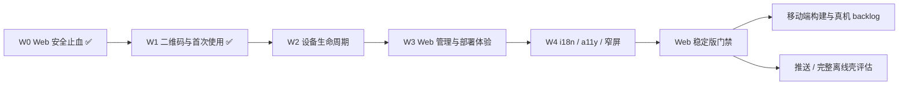

# 10 Web-first 后续迭代路线图

状态：**执行中（2026-08-15）**。基线为 `41201cb`：Web 安全止血、真实 dsh HTTP/HTTPS/WSS 矩阵和浏览器 E2E 已通过，详见 [09](09-web-security-hardening.md)。产品优先级已调整为 **Web 优先**；Android/iOS 构建、签名、发行与真机门禁保留在 backlog，不阻塞当前 Web 易用性。

## 1. 优先级结论

当前顺序：

1. 做好扫码即到配对页的 Web 首次使用体验。
2. 完成 Web 设备会话生命周期：识别、过期、吊销、退出、忘记主机。
3. 补齐 Web 管理与部署易用性：设备管理、明确诊断、反代/TLS 配置、可复制链接。
4. 做 Web 国际化、无障碍和窄屏体验。
5. 达到 Web 稳定版门禁后，再恢复 Android/iOS、移动 UI 插件和正式发行。
6. 推送、完整离线壳等高成本能力最后评估。

## 2. 当前基线与缺口

| 方向 | 当前状态 | 结论 |
|---|---|---|
| Web 安全 | ✅ 已完成 | 代理崩溃、443 解析、主令牌配对泄漏、异常 HTTP/WS、跨站请求均已修复并自动化 |
| Web 配对 | ✅ 二维码已完成 | 终端离线 QR + `/launch#pair=` 深链 + 一次确认；输入 `n` 可签新码，后台 API 返回 pairing URLs |
| 设备会话 | 🟡 部分完成 | 已有签名设备令牌、30 天过期和 HttpOnly Cookie；缺单设备吊销、退出/忘记和设备管理 |
| Web 管理 | 🔴 缺失 | 无设备列表、吊销界面、连接诊断页和明确的反向代理/public URL 引导 |
| Web 文案与可访问性 | 🟡 基础 | 目前主要为中文硬编码；尚无中英文切换和系统化键盘/读屏门禁 |
| Android/iOS | ⏸ 后移 | 构建脚本、正式签名、真机门禁问题已经记录，但当前不占 Web 迭代资源 |
| 移动 UI 插件 | ⏸ 后移 | 原外部仓库当前无法访问；等 Web 稳定后再归仓恢复，不再阻塞浏览器交付 |

## 3. W1：二维码与首次使用（已完成，2026-08-15）

目标：主机启动代理后，用户拿手机扫码、确认一次即可进入，不抄地址、不手输 6 位码，也不接触主令牌。

设计：

- 配对 URL 使用 `http(s)://<代理>/launch#pair=<6位单次码>`；fragment 不进入 HTTP 请求、访问日志或 Referer。
- 二维码只包含代理地址和 10 分钟、单次使用的配对码，绝不包含主令牌或设备令牌。
- 扫码打开后立即清除 fragment、预填配对码，但必须由用户点一次“确认配对并连接”；避免系统链接预览或安全扫描器误消耗单次码。
- 代理从局域网 IPv4 自动生成候选链接；反向代理、域名或多网卡场景用 `DSH_PUBLIC_URL` 明确覆盖。
- 终端为首个候选链接本地离线生成 QR，不调用任何在线二维码服务。非交互运行不输出 ANSI QR；`DSH_PAIR_QR=off` 可显式关闭。
- 交互终端输入 `n` 回车即可生成新码/链接/QR；脚本和后台部署仍可调用主令牌保护的 `/pair/new`，响应同时返回 pairing URLs。

完成门禁：

- QR 编码器固定版本和 MIT 许可证，离线构建可复现。
- 自动化覆盖 public URL、局域网地址发现、fragment 格式、二维码快照、扫码预填、无效码、单用/重放和不自动兑换。
- 真实浏览器完成“深链打开 → URL 清理 → 一次确认 → DeepSeek Harness → 刷新保持会话”。
- HTTP 和 HTTPS/WSS 真实 dsh 全矩阵继续通过。

## 4. W2：完整设备生命周期（下一迭代，P0）

目标：让 Web 用户能看懂“这台设备是谁、何时过期”，并能主动退出或只吊销某一台设备。

交付物：

1. 新增版本化设备登记文件（建议 `DSH_STATE_FILE`）：只存设备 ID、名称、签发/到期/吊销时间，不存 bearer；`0600` 权限、临时文件 + 原子替换，损坏状态 fail closed。
2. 设备令牌校验同时检查 HMAC、到期和登记/吊销状态；清理过期记录。旋转主令牌仍可吊销全部设备。
3. 当前设备退出接口吊销自身并清除 Cookie；主令牌管理入口可列出和单独吊销设备。
4. `/launch` 增加“退出当前设备”“忘记此主机”；操作幂等，完成后回到干净配对页。
5. 浏览器长期凭据继续只存在 HttpOnly Cookie；URL、响应正文、`localStorage` 不出现主令牌或设备令牌。
6. 测试可用短 TTL，生产默认保持 30 天。

完成门禁：单设备吊销不影响其他设备；退出、忘记、到期、代理重启、损坏状态、篡改和旋转主令牌均有 HTTP/WS 与真实浏览器证据。

## 5. W3：Web 管理与部署易用性（P1）

目标：不读源码也能部署、排错和管理连接。

- 增加仅主令牌/本机管理员可用的设备管理界面或 CLI，展示设备名、签发时间、最后使用、到期和吊销状态。
- 启动日志明确列出监听地址、可扫描地址、TLS 状态和上游健康；多网卡时说明如何用 `DSH_PUBLIC_URL` 选择正确地址。
- 给 Caddy/Nginx/Tailscale 各一份最小可复制配置，明确 `Host`/WebSocket/TLS 要求。
- 启动页区分“代理不可达、码无效/已用、会话过期、上游 dsh 不可达、跨站拒绝”，不再全部显示为笼统连接失败。
- 提供复制链接、新建配对码和下载 SVG QR 的管理员入口；SVG 响应 no-store，仍只编码单次码。
- 保持 `DSH_LAUNCHER=off` 的纯代理模式。

完成门禁：全新用户只依据 README 能在局域网和 HTTPS 域名两种场景部署；常见故障均有稳定错误码、文案和自动化。

## 6. W4：国际化、无障碍与窄屏体验（P1）

- 抽取启动页、错误、设备管理文案，至少支持中英文，并按浏览器语言选择、允许手动切换。
- E2E 使用稳定 `data-testid`/语义角色，不绑定中文文本。
- 键盘完整操作：Tab 顺序、可见 focus、Enter 提交、错误与状态使用 live region。
- 检查色彩对比、200% 缩放、320px 窄屏、横屏、移动 Safari/Chrome。
- saved host 失效时直接给出重新配对/忘记选项，避免循环跳回。
- 只考虑“启动页可离线显示”的轻量 PWA；完整 dsh UI 离线壳仍后置，因为它需要前后端版本协商。

## 7. Web 稳定版门禁

满足以下条件才把 Web 标为稳定：

1. W1–W4 的安全与 E2E 全过，HTTP/HTTPS/WSS 矩阵无回归。
2. Chromium、移动 Chrome、移动 Safari 至少各一次扫码配对、退出、吊销、重连验证。
3. 真实模型流、审批操作、长工具输出和断网重连在移动浏览器可用。
4. 公网文档只推荐可信 HTTPS；二维码、日志、错误页均不泄漏长期凭据。
5. CI 从干净 checkout 可复现全部 Web/代理测试；第三方许可证完整。

## 8. Android/iOS 后移 backlog

Web 稳定后再处理，不与当前迭代并行抢占优先级：

- 统一 `npm ci → sync → lint/test → build`；当前 Web/代理与 iOS 模拟器构建链已可复现，Android 仍需具备本机 SDK 后执行。
- Android release keystore、签名 APK/AAB、版本升级和签名校验。
- iOS 真机签名、Archive、TestFlight 和版本同步。
- 恢复 `dsh-mobile-ui` 源码到同仓库，固定依赖并共同测试。
- Android+iPhone 各一台执行 A/B/C/D/E/U 真机门禁，覆盖模型流、审批、断网、后台和覆盖升级。

这些事项仍是正式移动发行的 gate，但不阻塞 Web 稳定版。

## 9. 更后面的体验项

- **推送**：需要 APNs/FCM、主机到推送服务的信任模型和隐私设计，单独 ADR；通知 payload 不得携带模型内容或令牌。
- **完整离线壳**：会改变“加载主机同版本前端”的架构，必须先定义版本协商、缓存失效和回滚。
- **桌面安装/PWA 深化**：在 W4 轻量 PWA 数据充分后再决定。

## 10. 建议提交边界

| 迭代 | 内容 | 主要证据 |
|---|---|---|
| W1a | 离线 QR、public URL、终端快捷新码 | ✅ QR 单测、许可证、启动日志 |
| W1b | fragment 预填和真实浏览器扫码深链 | ✅ launcher 回归、Chromium/WebKit + 移动视口 E2E、HTTP/TLS 28/28 |
| W2a | 设备登记、吊销、退出 API | HTTP/WS/重启/损坏状态自动化 |
| W2b | `/launch` 退出/忘记与设备管理入口 | 浏览器多设备 E2E |
| W3 | 部署诊断、复制链接/SVG、反代文档 | LAN + HTTPS 部署验收 |
| W4 | 中英文、a11y、窄屏/PWA launcher | 多浏览器/移动视口 E2E |
| Web GA | 同提交发布 Web 稳定版 | 完整门禁和升级说明 |
| Mobile+ | Android/iOS backlog | Web GA 后另排 |
